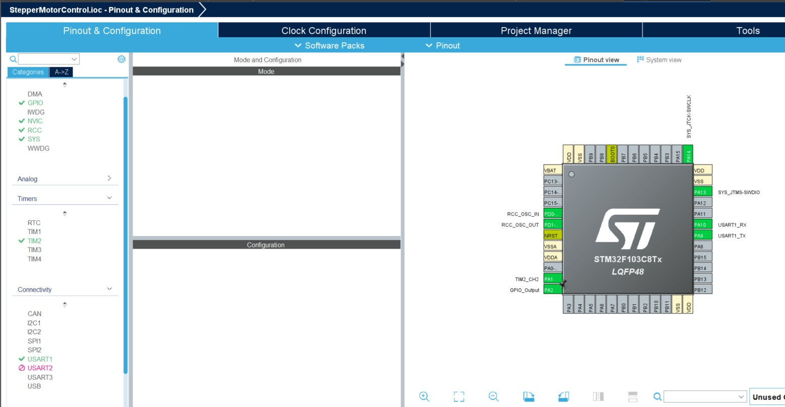
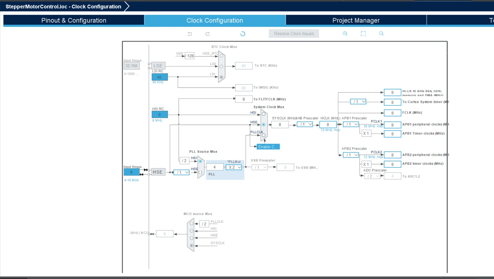

# NEMA17 Stepper Motor Control
This code is made for **STM32F103C8T6** aka "Blue Pill" and it demonstrate a basic control of NEMA17 stepper motor with A4988 driver module. This driver module simplifies and converts the 2-pole, 4-wire interface of the motor to a simple 2-wire interface that comprises on STEP and DIR signals. Each pulse on STEP line generates a single step rotation on the motor, while DIR signal provide the direction of rotation. 
Here is how the two signals are controlled in the firmware:
- STEP signal is controlled by TIM2 in PWM generation on Channel 2. This config geneates a clock signal on PA1.
- DIR signal is controlled by GPIO pin PA2. It is set to low/high at the time of enabling the STEP PWM to set the direction
### Control Interface ###
Stepper motor control interface is provided by a serial uart (USART1 of the STM32). This is also used for debug printing. There are two commands supported at the moment:
- START <speed in RPM> <Direction(0/1)>
- STOP
### Dev Tools Used ###
Basic peripheral selection and configuration is done by using STM32CubeIDE's pinout and configuration tool. 

Github copilot integration in VS code provided a super fast way to quickly implement this demo firmware. 

### Demo ###
[Watch the video](images/demo.mp4)